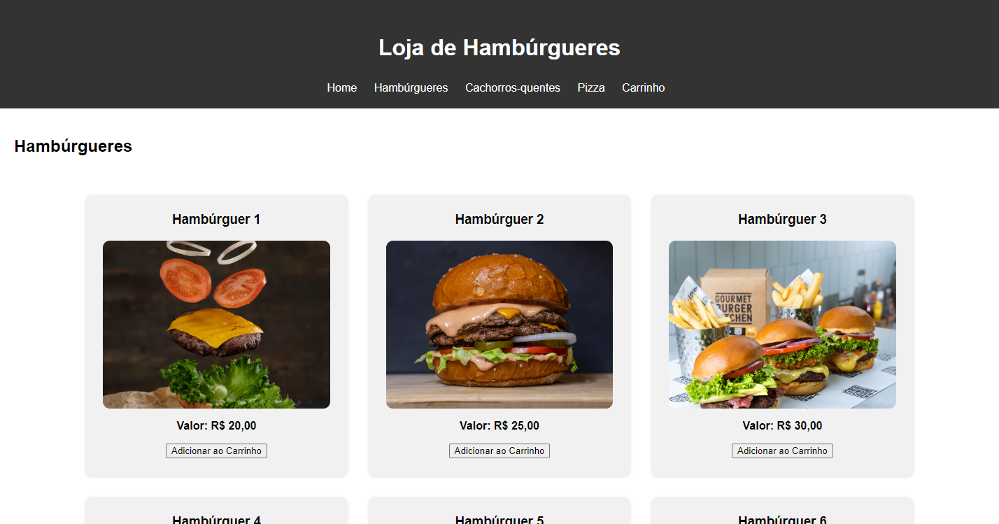
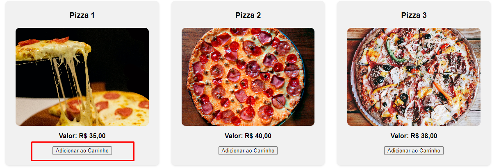
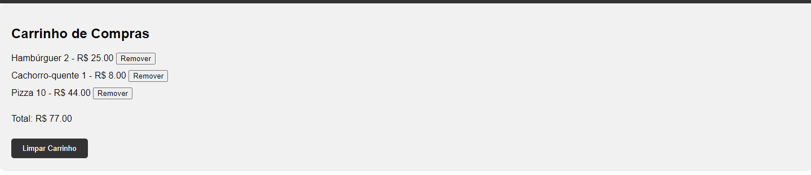

# Projeto Lanchonete

Neste Projeto Eu Usei Html, Css e JavaScript 

### Fiz Um Home com:

- Seção "Home"
- Seção "Hambúrguer"
- Seção "Cachorro-quente"
- Seção "Pizza"
- Seção "Carrinho de Compras" 

### Nas Seções:

Nas seções de Hambúrguer, Cachorro-quente e Pizza, há um botão para adicionar o item ao carrinho.

### Na Seção "Carrinho":
Aqui estão listados todos os itens para os quais cliquei no botão "Adicionar ao Carrinho". Os itens estão somados, com o total exibido ao final. Além disso, há uma função para limpar o carrinho.

